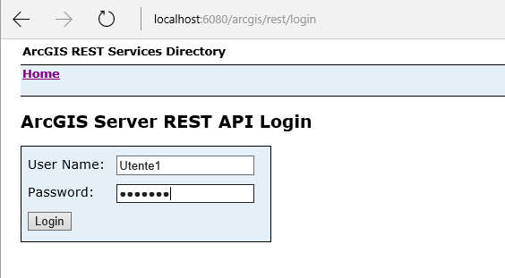
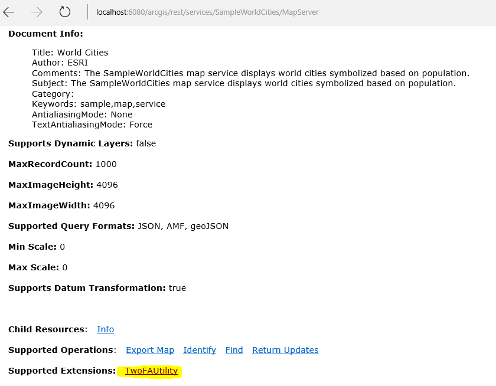
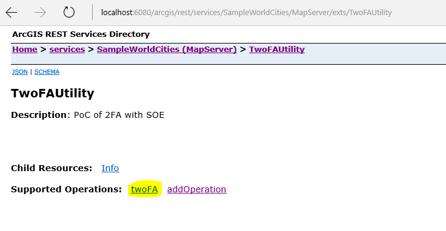
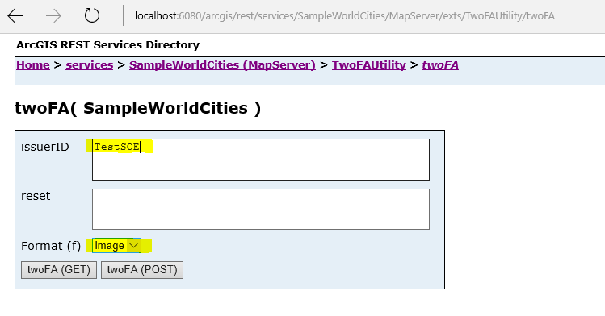
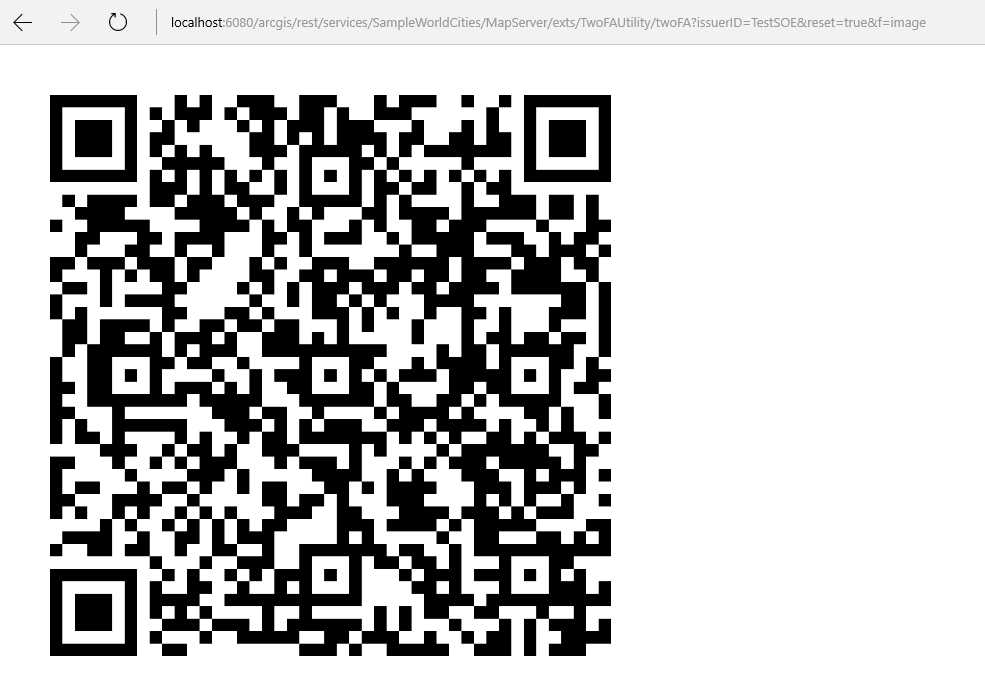
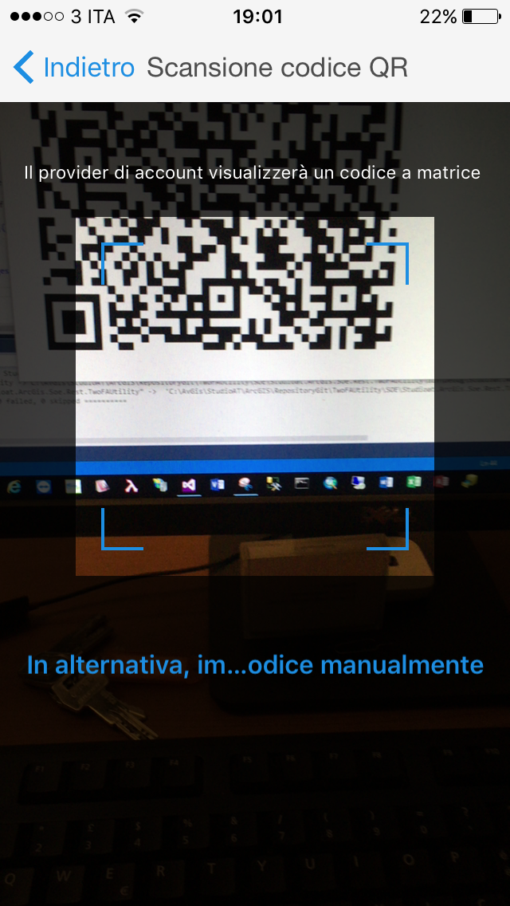
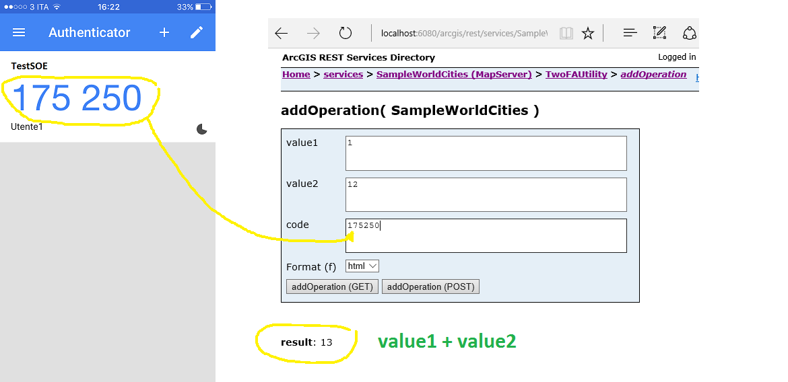
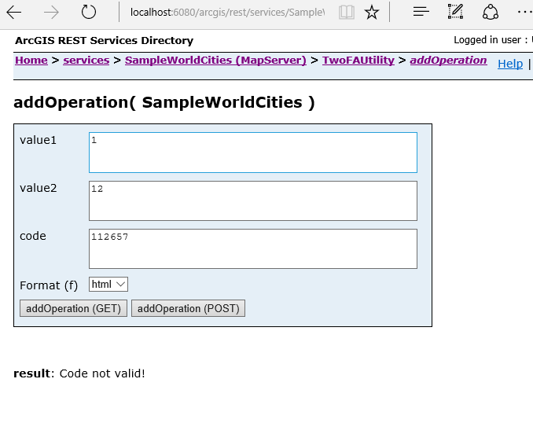

# 2FA using operations SOE

## Description
This is a Proof of Concept (PoC) using 2FA (two factor authentication) in a operation of SOE.

This SOE has two operations:

- **twoFA**: authorizes the current user to 2FA

- **addOperation**: an add operation (value1 + value2)
 

You need secure ArcGIS Server service

In this sample I secure 'SampleWorldCities' service with user 'Utente1'.

*Login using a user* 
  

*Click on TwoFAUtility SOE*

*Click on TwoFA operation*

Set **issuerID** and **format** image so you see qrCode for [Google Authenticator](https://support.google.com/ACCOUNTS/ANSWER/1066447) (Android, iOS) or [Authenticator](http://www.windowsphone.com/EN-US/STORE/APP/AUTHENTICATOR/E7994DBC-2336-4950-91BA-CA22D653759B) (Windows Phone, iOS, Android). 

The issuerID will appear on the user's Google/Microsoft Authenticator app. It should be the name of your app/system so the user can easily identify it.
 
**Reset** parameter is optional (default = false). If you set true and the current user has yet set 2FA the secret key is regenerated.

*Click on twoFA(Get)*

Use Google Authenticator to read qrcode

or Authenticator of Microsoft to read qrcode

Scan QR code with photo camera

If I give the code from Authenticator in operation 'addOperation', SOE returns result of operation 

otherwise SOE returns error

